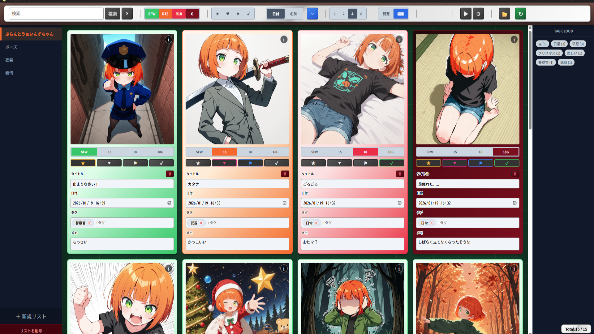
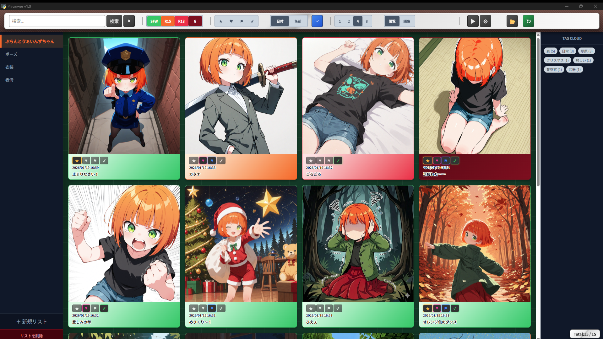

# ⚠️ はじめに

このアプリケーションは AI（Gemini）との対話を通じて作成されました。

私自身はエンジニアではありませんが、AI のサポートを活用しながら開発・構築を行いました。

そのため、コードに無駄があったり美しくなかったりするかもしれません。

なんならこの文章も全部書いてもらいました。なので、ちょっと強気なことを書いてるかもしれません。





# 🌱 ぷらびゅーわー（Plaviewer）について

Plaviewer は、直感的な操作で大量の画像を整理・閲覧できる、軽量なデスクトップ向け画像管理アプリです。

Python と Web技術（HTML/CSS/JS）を組み合わせた pywebview によって構築されており、シンプルながらも強力なタグ管理やフィルタリング機能を備えています。


# 🌟 主な機能
シームレスな画像管理: ドラッグ＆ドロップで画像やフォルダを簡単に追加できます。

柔軟なリスト機能: 複数のリスト（タブ）を作成して、目的別に画像を分類・整理できます。

強力なタグ＆レーティング: 画像ごとにタグを自由に設定でき、SFWからR18Gまでのレーティング管理も可能です。

高度な検索・フィルタリング: キーワードやタグ（#タグ名）による検索、お気に入りやチェック等のフラグによる絞り込みが可能です。

グリッド表示のカスタマイズ: 閲覧枚数に合わせて、1列から8列まで表示枚数を即座に切り替えられます（8列だと表示が崩れるかもしれません）。

詳細なメタデータ閲覧: 画像に含まれるPNG情報（生成パラメータ等）の確認やコピーが可能です。

スライドショーモード: 指定した間隔で、順番またはランダムに画像を連続表示できます。

オートセーブ機能: 編集内容は自動的に保存されるため、作業を中断しても安心です。


# 🚀 使い方
#### 実行ファイルで利用する場合（推奨）

Releases ページから最新の Plaviewer.zip をダウンロードして解凍してください。

Plaviewer.exeと同じ階層にlistフォルダがあります(なければ生成されます)。ここに各リストフォルダが保存され、その中に画像を収納していく仕組みです。


#### ソースコードから実行する場合

Python 3.x がインストールされている環境で、以下のライブラリが必要です。

```bash
pip install pywebview Pillow
```

リポジトリをクローンまたはダウンロードし、以下のコマンドを実行してください。

```python
python app.py
```

# 🛠 開発者向け情報
Frontend: HTML5, CSS3, JavaScript (Vanilla JS)

Backend: Python 3, pywebview

Data Storage: list/ フォルダ内に各リストの画像と metadata.json が生成・管理されます。


# 📄 ライセンス
このプロジェクトは MIT ライセンスの下で公開されています。

# 🤝 開発・カスタマイズについて
このプロジェクトはオープンソースです。

私自身はエンジニアではありませんが、AI（Gemini）を活用してここまで形にすることができました。

「もっとこうすれば良くなる」「こんな機能が欲しい」といったアイデアや、コードの改善（プルリクエスト）は大歓迎です。

ぜひ皆さんの手で、Plaviewerを自由にカスタマイズして楽しんでください！
